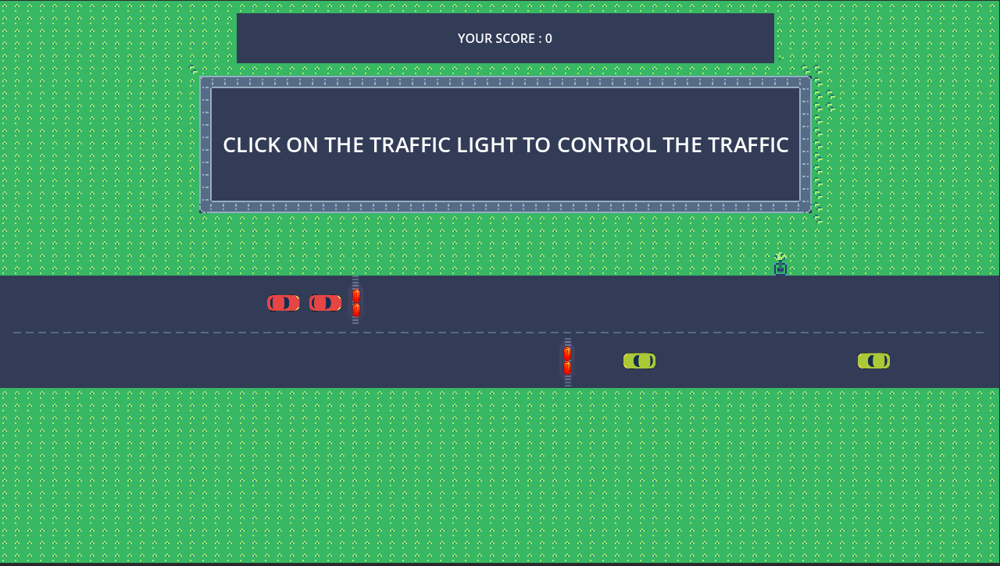

# JAMMED

In my quest to get into game development, I decided to build Jammed on [Godot](godotengine.org). A simple game, where you control traffic on a city block.

Music is done by me, you can find it on [bandlab](https://www.bandlab.com/track/95fff0b2-69c4-4302-bd40-9854c4741f78?revId=645ad3d0-86dd-48c0-a980-7b4166d4feb1). 

Sprites are by [Pixelianska](https://pixelianska.itch.io/), [MadFireOn](https://swapnilrane24.itch.io/), [Marceles](https://marceles.itch.io/)

